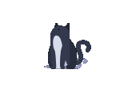

<h1 align="center">Hi 👋, I'm Sarcon Ulama</h1>

<table>
<tr>
<td valign="top" width="100%">

<h3>A passionate developer from Philippines 🇵🇭</h3>

  

* 🔭 I’m currently working on **Polymedic Site**
* 🌱 I’m currently learning **BS-Information Technology**
* 👯 I’m looking to collaborate on **Thrift E shop**
* 💬 Ask me about **Anything**
* 📫 How to reach me **[zedd5221@gmail.com](mailto:zedd5221@gmail.com)**
* ⚡ Fun fact **I'm unemployed final boss**

<h3>Connect with me:</h3>

</td>

<td valign="middle" align="center" width="35%">

</td>
</tr>
</table>

<h3 align="left">Languages and Tools:</h3>

